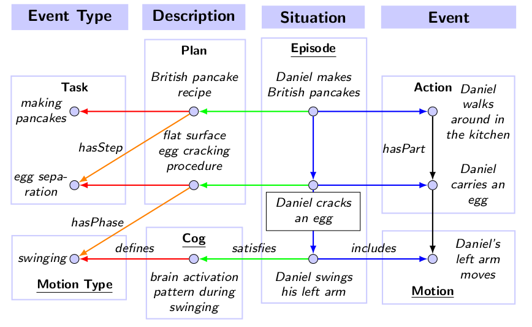

knowrob_actions
===

The purpose of this module is (1) to provide a Prolog interface to access knowledge encoded using KnowRob's action model; and (2) to provide some inference rules that exploit knowledge encoded using this model.

### Action model

In KnowRob, an *Action* is defined as an *Event* where at least one agent that participates in the event executes a *Task* which is typically defined in a *Plan*. Tasks are used to classify actions, similar to how roles are used to classify objects within some situational context. There may be multiple plans defining the same task which is useful to capture different ways to achieve the same goal. The distinction between *Action* and *Task* is further important as it enables us to put individual tasks into discourse without referring to a particular execution of them (i.e. an *Action*). This is needed because a *Plan* is a generalization of action executions, abstracting away from individual objects that were involved by only referring to the roles they have played.

**Plans** are used to structure tasks, asserting how they are composed of steps and in which order they should be executed. KnowRob supports relations from Allen's Interval Algebra to assert ordering constraints between steps, and also allows to only specify partial ordering. Each step of a plan is a task itself, and may also be defined by some plan(s). However, the action model of KnowRob allows to go deeper by decomposing a task into *phases*. A phase is a *Process* or *State* that occurs during task execution which includes force dynamic events, and motions. Processes are classified by one of the *ProcessType* concepts, and states are classified by one of the *Gestallt* concepts defined in the model.

**Roles** are used to classify objects that participate in some event. This includes the agent that performed the action, tools that were used, objects that were affected, as well as locations of interest. KnowRob defines a taxonomy of roles with the most general concepts being *Patient*, *Instrument*, and *Location*. The list of concepts defined below is comprehensive but might not be complete. However, it provides a rich labelset to classify objects in the scope of an activity. They are further used to implicitely encode pre-conditions of plan executions as the existence of objects that are potential filler of the roles is required.

### Action planning

The action model asserts the structure of tasks via plans that decompose them into different steps and phases. Plans further assert a partial ordering between these constituents from which possible sequences of step and phase occurences that would manifest a plan execution can be derived.

To infer possible sequences of steps for a given plan, the following can be used:

    workflow_sequence(+Plan, ?Steps)

This will internally build up a, so called, endpoint sequence graph (ESG), a datastructure that captures temporal relations between event endpoints (i.e. when they start and when they end), and from which all possible sequences can be sampled.

More generally, to read all the steps and phases of a plan, and temporal constraints between them, the following can be used:

    workflow_constituents(+Plan, -Constituents, -Constraints)

Where *Constraints* is a list of binary relations between steps/phases of the plan, for example, the constraint `<(A,B)` means that the occurance of an event of type *A* is strictly before the occurance of an event of type *B*.

### Action detection

The model of plans can be casted as grammar for a parser that yields actions from observed event endpoints which are used as tokens for the parser. This can be used to classify activities given evidence that is more easy to observe such as state changes, contact events, and motions.

A parser can be created given a list of plans:

    parser_create(Parser,[
        ptest:'Grasping_WF0',
        ptest:'Lifting_WF0',
        ....
    ])

Which will create ESG's for each of the plans.

The parser runs in its own thread which can be started by calling `parser_start/1`. Once started, tokens can be added to the parser using the predicate `parser_push_token/2`. When done, the parser can be stopped again by calling `parser_stop/1`. This will synchronize all threads, and block until the parser thread exits. A second variant `parser_stop/2` provides the remaining parser output in its second argument.

    parser_start(Parser),
    parser_push_token(Parser,tok(0.0,c, -(ptest:'Touching'), ['TestHand','TestObject']),
    ...
    parser_stop(Parser,Outputs).

The default mode of the parser is that it yields all actions that are detected no matter if they conflict with each other (i.e. because they provide different interpretations of the same event). However, the predicate `parser_start/2` allows to switch to another mode by setting the *compose* flag in the option list which is the second argument of the predicate. This flag causes the parser to compose individual actions into an activity without conflicting actions.

### Action execution

From the perspective of the knowledge base, some steps in plans may be atomic, meaning that there is no plan further structuring them. KnowRob further allows to specify how such tasks are to be executed by calling a computational method such as a predicate in the knowledge base, or a service within a ROS communication graph.
This is useful in case the knowledge base needs to send commands to remote methods, or to support the parametrization of such calls by relating the arguments of the method to situational context.

The execution of "atomic" actions is axiomatized using a particular type of plan called *ActionExecutionPlan*. Action execution plans are used to relate roles and parameters of the situational context to inputs and outputs of the computational method that performs the execution.

Let's say we have an execution plan *rdf_has_plan* defined for the `rdf_has/3` predicate. To execute the plan, the following code can be used:

    execute_plan('rdf_has_plan',_{},OutputDicts,_)

In this case, the `rdf_has/3` predicate would be called with none of the arguments grounded since an empty dict is provided as second argument (which provides an initial grounding). *OutputDicts* is a lazy list of all possible groundings, i.e., triples in the knowledge base in this case. The keys in each dict are concepts, and the values are the entities they classify.

### Action effects

The effects of actions on objects are derived from the roles the objects play during the action. For example, whenever an object plays the role of being the *AlteredObject* one of its qualities is being altered to some level. Hence the effect of the action is an alteration of the region of the quality which may be automatically updated by KnowRob after the action has been executed. Other distinct cases are objects being destroyed or created in which case KnowRob updates the lifetime of them, and objects being combined, included, or excluded in which case KnowRob may update relations between these objects.

The predicate `action_effect/2` relates an action (or task) to its effects, for example:

    action_effect(pancake:'CrackingAnEgg', destroyed(pancake:'Egg'))

This states that some *Egg* is destroyed when *CrackingAnEgg* tasks are executed. It is also possible to query for tasks that have certain effects by calling this predicate with the first argument ungrounded:

    action_effect(Tsk, destroyed(pancake:'Egg'))

Which corresponds to the question *how can eggs be destroyed*. Finally, with the second argument ungrounded, all known effects of the task are inferred.

Some action effects may imply new relations, for example, that one object is part of another after the action has been performed. Consequently, KnowRob also provides a predicate to maintain these relations automatically based on the roles objects play during the action. To infer and assert these relations, the predicate `action_effects_apply/2` can be used, for example:

    action_effects_apply(pancake:'CrackingAnEgg',_{
      'DestroyedObject': 'Egg_0'
    })

Note that "destroying" an object in KnowRob does not mean that knowledge about it disappears. Each object has an associated lifetime, and an event that destroys some object determines the end of its lifetime rather then vanishing its existence in the knwoledge base.
