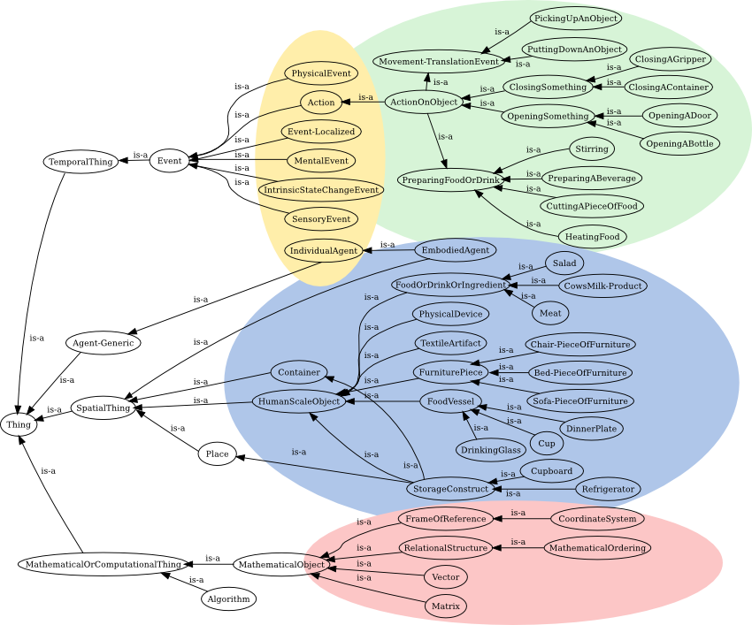

knowrob_common
===

This package provides the core ontologies and reasoning rules
of the KnowRob knowledge processing system for robots.

### Semantics

KnowRob uses the Web Ontology Language (OWL) in combination with
rule based reasoning powered by SWI Prolog.
OWL ontologies can be parsed (owl_parse/1) which causes new facts to be
asserted in the RDF triple store of SWI Prolog.
SWI Prolog already provides querying with RDFS semantics
(rdf_has/3, rdfs_individual_of/2).

Ontop of the RDFS semantics KnowRob implements a minimal OWL reasoner in Prolog.
owl_individual_of/2 checks if a resource satisfies a class description
according to OWL-Description entailment rules,
and owl_has/3 checks if a relation can be deduced using OWL inference rules.
Some OWL2 features such as property chains are also supported,
but the reasoner is not OWL2 complete.

Between the RDFS and OWL layer KnowRob implements the computable semantics layer.
OWL ontologies may describe how the existence of a relation can be computed
in a given situation, and KnowRob uses the computation rules at query time
to allow data abstraction on demand.
The current implementation includes computable properties for
qualitative spatial reasoning (comp_spatial),
temporal reasoning about events (comp_temporal),
object pose computation from tf message channel and mongo DB (knowrob_objects, knowrob_mongo),
and SWRL rules (swrl.pl).
owl_compute_individual_of/2 expands owl_individual_of/2,
and owl_compute_has/3 expands owl_has/3 with computable semantics.

Another additional semantic layer is added by KnowRob to integrate
temporal information in the reasoning process,
allowing robots to reason about past events.
KnowRob follows the convention that objects generally can have
temporal parts, which describe relations that only hold
during the lifespan of the temporal part.
temporal.pl provides interfaces to maintain the temporal parts
of an object.
owl_individual_of_during/3 expands owl_compute_individual_of/2,
and owl_has_has/4 expands owl_compute_has/3 with temporal semantics.
Finally, holds/2 allows to put triples in a term Predicate(Subject,Object):

    holds(knowrob:volumeOfObject(Obj, literal(type(xsd:float,15.0))), 25.0)

### Ontologies

### Entity descriptions

    entity(Cont, [an, object,
        [type, container]]).

    entity(Loc, [a, location, [in-cont_generic,
        [an, object, [type, container]]]]).
    
    entity(Obj, [an, object,
        [type, storage_construct],
        [type, restriction(
            knowrob:'typePrimaryFunction-containerFor',
            some_values_from(knowrob:'Perishable'))]
    ])

