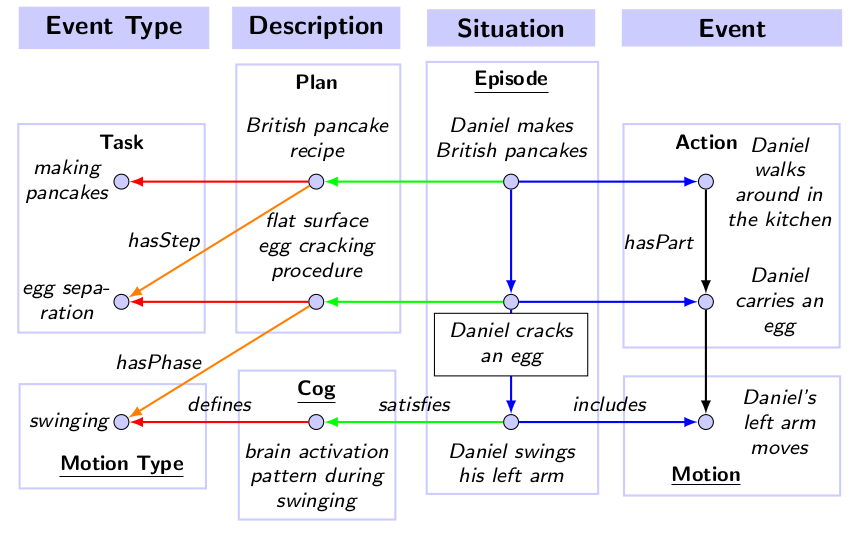

\page ontologies Ontologies

KnowRob supports the Resource Description Framework (RDF) which is similar to
classical modelling approaches such as entity-relationship and class diagrams.
In the RDF model, statements about *resources* can be represented
in form of *subject-predicate-object* triples that express a relationship
between subject and object of the triple.
Models in KnowRob *usually* build ontop of RDF. 
One category of KnowRob Models are extensions of the modelling language
that introduce new resources such as
*XML Schema Data Types* (XSD),
*RDF Schema* (RDFS), and
*Web Ontology Language* (OWL).
The other category of models define
*RDF ontologies* that conceptualize entities, and
allow some form of reasoning.

### Ontology Languages

RDFS is an ontology language that can be used to represent *taxonomies*
through *subClassOf* and *subPropertyOf* relationships.
It further allows to define the *domain* and *range* of properties --
i.e. what type of subject can be the host the property,
and what type of object can be the value of it. 
RDFS is integrated into the KnowRob Language through a set
of language terms including `has_type/2`,
`has_range/2`, and  `has_domain/2`.

OWL is another ontology language, but more expressive then RDFS.
Please refer to the [OWL2 overview](https://www.w3.org/TR/owl2-overview/) for
complete information about it.
The OWL language supports some more advanced class relationships such as
*intersectionOf* and *complementOf*, property cardinality restrictions,
and additional property characteristics such as *inverse* and *functional*
properties.
KnowRob integrates with the OWL language by declaring a set of language
terms, and how they map into the RDF model.
An example of an OWL language term is shown below:

    has_inverse_property(Property,Inverse) ?+>
        triple(Property,owl:inverseOf,Inverse).

This *querying+projection* rule declares that the term `has_inverse_property/2` is mapped
to RDF by using *owl:inverseOf* as predicate in the triple.
KnowRob's language further supports OWL class expressions in arguments of
language terms. Such class descriptions can used with the core terms
`instance_of/2`, `subclass_of/2`, and `holds/3`, for example:

    :- instance_of(Subject,some(Predicate,Object)). 

Where the term `some/2` maps to an existential restriction class
in the OWL language.
Please refer to source code documentation for a full list of OWL
language terms.

### Ontology Organization

KnowRob ships with a set of OWL ontologies organized
into upper-level, domain and application ontologies.

A *upper-level ontology* (also called foundational ontology) defines
concepts that are useful across disciplines such as event and object,
and general relations such as parthood and participation. 
KnowRob uses the [DOLCE+DnS Ultralite](http://ontologydesignpatterns.org/wiki/Ontology:DOLCE+DnS_Ultralite) (DUL) upper-level ontology which is a
*"lightweight, easy-to-apply foundational ontology for modeling either physical or social contexts"*. 

A *domain ontology* is used to fix general terms in some domain.
The domain KnowRob was designed for is *everyday activities*.
KnowRob ships with the
[Socio-physical Model of Activities](https://github.com/ease-crc/soma) (SOMA)
ontology which derives its notions from the DUL upper-level.
However, it is possible to configure KnowRob for other discipines by
using different domain ontologies.
Another domain ontology in KnowRob has the scope 
to capture categories underying robot control.
This includes the concepts sensor, actor, and capability.

Finally, an *application ontology* isMoreGeneralThan all application-specific definitions.
As KnowRob is a general framework, no such ontology will be auto-loaded by default.
However, some application ontologies are available as part of public
[repositories](https://github.com/knowrob/),
and hosted by the [openEASE webservice](http://www.open-ease.org/).

### Activity Model

In KnowRob, an *Action* is defined as an *Event* where at least one agent that participates in the event executes a *Task* which is typically defined in a *Plan*. Tasks are used to classify actions, similar to how roles are used to classify objects within some situational context. There may be multiple plans defining the same task which is useful to capture different ways to achieve the same goal. The distinction between *Action* and *Task* is further important as it enables us to put individual tasks into discourse without referring to a particular execution of them (i.e. an *Action*). This is needed because a *Plan* is a generalization of action executions, abstracting away from individual objects that were involved by only referring to the roles they have played.

**Plans** are used to structure tasks, asserting how they are composed of steps and in which order they should be executed. KnowRob supports relations from Allen's Interval Algebra to assert ordering constraints between steps, and also allows to only specify partial ordering. Each step of a plan is a task itself, and may also be defined by some plan(s). However, the action model of KnowRob allows to go deeper by decomposing a task into *phases*. A phase is a *Process* or *State* that occurs during task execution which includes force dynamic events, and motions. Processes are classified by one of the *ProcessType* concepts, and states are classified by one of the *Gestallt* concepts defined in the model.

**Roles** are used to classify objects that participate in some event. This includes the agent that performed the action, tools that were used, objects that were affected, as well as locations of interest. KnowRob defines a taxonomy of roles with the most general concepts being *Patient*, *Instrument*, and *Location*.
