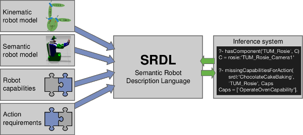

knowrob_srdl
===

The Semantic Robot Description Language (SRDL) extends KnowRob with representations for robot hardware,
robot software and robot capabilities. The hardware models can automatically be
[imported from a URDF description](http://knowrob.org/doc/create_srdl_model),
and are annotated with additional semantic information.
For example, one can annotate semantically meaningful groups of links such
as the left arm or the right gripper. SRDL integrates
this information into KnowRob, allowing the system to reason about the robot's configuration.
In addition, SRDL provides inference mechanisms that operate on the robot model and
are able to check which dependencies of
[action descriptions](http://knowrob.org/doc/doc/modeling_tasks_and_actions)
are available on the robot. This allows to identify missing components or capabilities.

### Ontology organization

The SRDL ontology is organized in a modular way, e.g. to describe only components or only capabilities.

* *srdl2*: Only generic cross-file relations like the generic dependsOn property
* *srdl2-comp*: Classes of hardware and software components, aggregation of components to kinematic chains, composition of components
* *srdl2-cap*: Classes of capabilities, including their dependencies on components or other capabilities
* *srdl2-action*: Dependency specifications for common actions
* *Robot model*: Description of a concrete robot instance including its kinematic structure (auto-generated from URDF file), other hardware/software components and hardcoded capabilities
* *Task model*: Description of the concrete task at hand, using the action classes defined in the srdl-action ontology

### More detailed documentation

Please visit [knowrob.org](http://knowrob.org/doc/srdl2_tutorial).